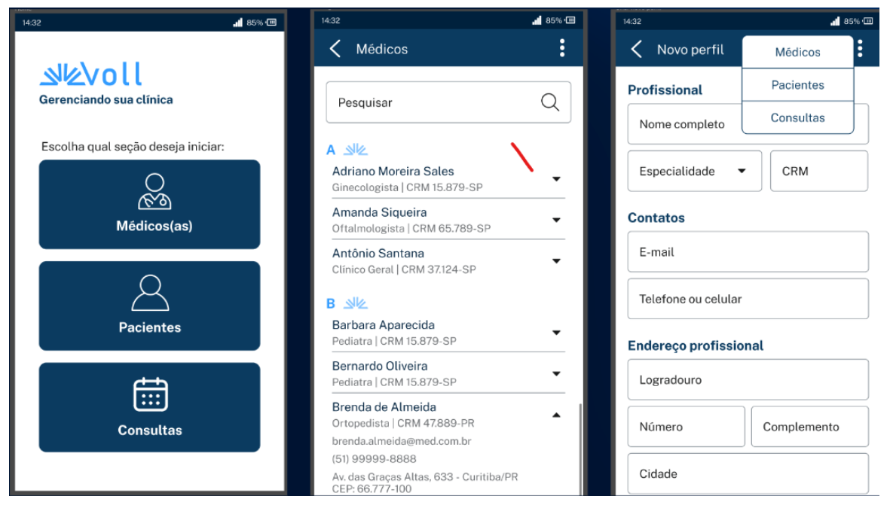

# Spring Boot 3: desenvolva uma API Rest em Java

API rest com Spring Boot, desenvolvido com Flyway como ferramenta de Migrations da API, e CRUDs utilizando o banco de dados MySQL.

O foco do projeto é criar uma aplicação com recursos médicos, onde podemos adicionar e deletar médicos do cadastro, assim como alterar seus dados. Ou seja, desenvolver um CRUD de uma API Rest usando o Spring Boot.

## Ideia de FrontEnd

Trabalharemos em um projeto de uma clínica médica fictícia. Temos uma empresa chamada Voll Med, que possui uma clínica que precisa de um aplicativo para monitorar o cadastro de médicos, pacientes e agendamento de consultas.

Será um aplicativo com algumas opções, em que a pessoa que for usar pode fazer o CRUD, tanto de médicos quanto de pacientes e o agendamento e cancelamento das consultas.

## Tecnologias utilizadas:

- Spring Boot 3
- Java 17
- Lombok
- MySQL/ Flyway
- JPA/Hibernate
- Maven
- Insomnia

